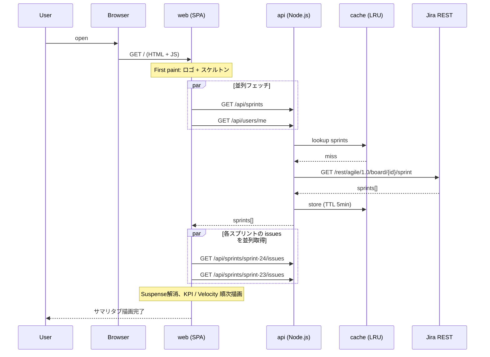
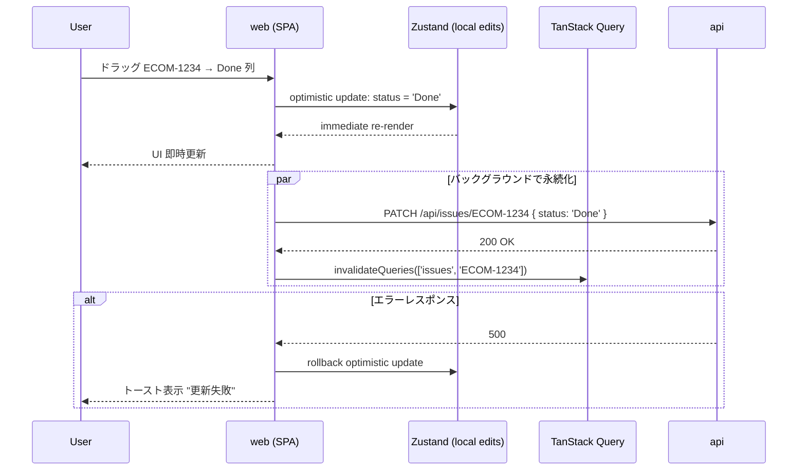
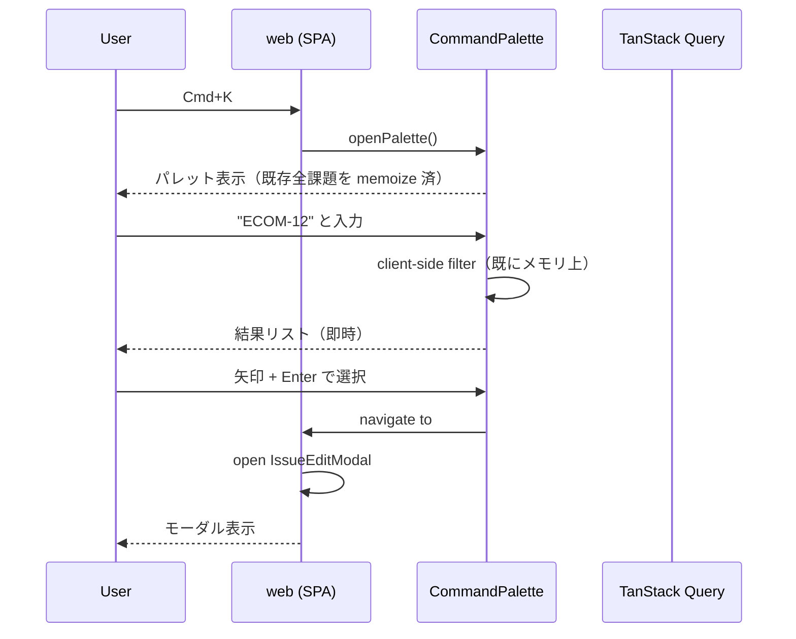
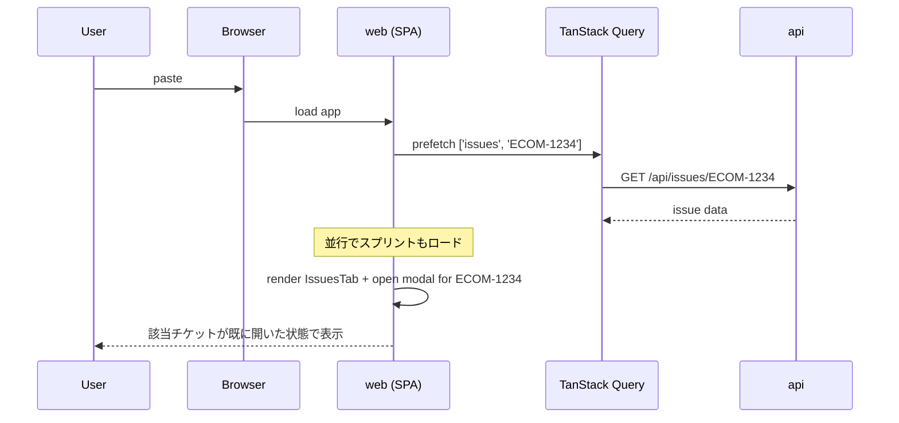

# Sequence Diagrams — Velocity Dashboard

作成者: Architect Agent
最終更新: 2026-06-03

性能上の hot path 5 つを Mermaid で記述。

---

## 1. 初回ロード（cold cache）



**性能目標**:
- ロゴ + スケルトン表示: 0.5 秒
- KPI 表示: 1 秒（warm cache なら 0.3 秒）

---

## 2. タブ切替（client-side only）

```mermaid
sequenceDiagram
    participant U as User
    participant W as web (SPA)
    participant Z as Zustand (ui store)
    participant Q as TanStack Query (cache)

    U->>W: click "ガント" タブ
    W->>Z: setActiveTab('gantt')
    Note over W: lazy import GanttTab
    W->>Q: useQuery(['sprints'])
    Q-->>W: cached data (no fetch)
    Note over W: GanttChart 描画
    W-->>U: 100ms 以内に表示

    Note over W: バックグラウンド refetch（staleTime 超過時）
    W->>+A as api: GET /api/sprints
    A-->>-W: fresh data
    Note over W: 差分があれば再描画（楽観的）
```

**性能目標**: タブ切替 ≤ 100ms（lazy import が初回のみ追加コスト ~50ms）

---

## 3. 課題のステータス変更（Kanban DnD、楽観的更新）



**性能目標**: ユーザー体感 0ms（楽観的更新）、永続化は別レーン

---

## 4. Cmd+K グローバル検索



**性能目標**:
- パレット起動: 50ms 以内
- 入力 → 結果: 同期計算（数百件程度ならフィルタは < 10ms）

---

## 5. 深リンク（Slack から URL ペースト）



**性能目標**: 深リンク → モーダル表示 ≤ 1.5 秒（warm cache なら 0.5 秒）

---

## 観測すべき計測点

実装時に next/prev 比較を容易にするため、以下に `performance.mark()` を仕込む:

| ID | mark タイミング |
|----|---------------|
| `boot:html-loaded` | HTML が DOMContentLoaded |
| `boot:react-mounted` | App コンポーネント mount |
| `boot:first-data` | 最初のスプリント取得完了 |
| `boot:first-paint-content` | KPI Cards 表示完了 |
| `tab:switch:start` | タブクリック |
| `tab:switch:painted` | 新タブの最初の意味あるコンテンツ |
| `mutation:optimistic` | 楽観的更新後の paint |
| `mutation:server-ack` | サーバーが 200 返却 |

`PerformanceObserver` で集計し、開発時はコンソールに出す。本番では Sentry / DataDog 等に送信を検討。
